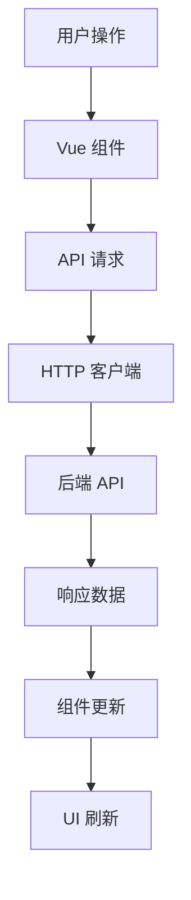
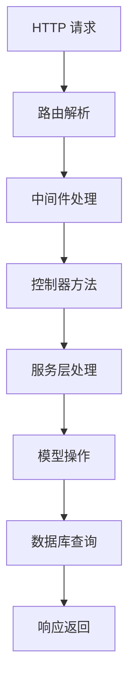

# 架构概述

Dux PHP Admin 是一个基于现代 PHP 技术栈构建的企业级后台管理系统，采用模块化设计和前后端分离架构。本指南将详细介绍系统的整体架构设计。

## 整体架构

### 系统分层

```
┌─────────────────────────────────────────────────────────────┐
│                    前端层 (Frontend)                          │
│  ┌─────────────────┐  ┌─────────────────┐  ┌─────────────────┐ │
│  │   Vue 3 SPA     │  │   DVHA 框架     │  │   Naive UI      │ │
│  │                 │  │                 │  │                 │ │
│  └─────────────────┘  └─────────────────┘  └─────────────────┘ │
└─────────────────────────────────────────────────────────────┘
                                │
                            HTTP/API
                                │
┌─────────────────────────────────────────────────────────────┐
│                     应用层 (Application)                      │
│  ┌─────────────────┐  ┌─────────────────┐  ┌─────────────────┐ │
│  │  控制器 (MVC)   │  │   中间件系统    │  │   路由系统      │ │
│  │                 │  │                 │  │                 │ │
│  └─────────────────┘  └─────────────────┘  └─────────────────┘ │
└─────────────────────────────────────────────────────────────┘
                                │
                                │
┌─────────────────────────────────────────────────────────────┐
│                    业务层 (Business)                         │
│  ┌─────────────────┐  ┌─────────────────┐  ┌─────────────────┐ │
│  │   服务层 (Service)│  │   事件系统     │  │   验证器        │ │
│  │                 │  │                 │  │                 │ │
│  └─────────────────┘  └─────────────────┘  └─────────────────┘ │
└─────────────────────────────────────────────────────────────┘
                                │
                                │
┌─────────────────────────────────────────────────────────────┐
│                   数据层 (Data Access)                       │
│  ┌─────────────────┐  ┌─────────────────┐  ┌─────────────────┐ │
│  │   模型 (Model)  │  │   数据库抽象    │  │   缓存系统      │ │
│  │                 │  │                 │  │                 │ │
│  └─────────────────┘  └─────────────────┘  └─────────────────┘ │
└─────────────────────────────────────────────────────────────┘
                                │
                                │
┌─────────────────────────────────────────────────────────────┐
│                   存储层 (Storage)                           │
│  ┌─────────────────┐  ┌─────────────────┐  ┌─────────────────┐ │
│  │     MySQL       │  │     Redis       │  │   文件系统      │ │
│  │                 │  │                 │  │                 │ │
│  └─────────────────┘  └─────────────────┘  └─────────────────┘ │
└─────────────────────────────────────────────────────────────┘
```

### 技术栈

#### 后端技术栈

| 技术 | 版本 | 用途 |
|------|------|------|
| PHP | 8.2+ | 核心语言 |
| dux-lite | 2.x | 核心框架 |
| Illuminate | 10.x | 数据库、缓存等组件 |
| Symfony | 6.x | 控制台、HTTP 组件 |
| Latte | 3.x | 模板引擎 |
| Monolog | 3.x | 日志系统 |

#### 前端技术栈

| 技术 | 版本 | 用途 |
|------|------|------|
| Vue.js | 3.x | 前端框架 |
| DVHA | 2.x | 管理后台框架 |
| Naive UI | 2.x | UI 组件库 |
| TypeScript | 5.x | 类型系统 |
| Vite | 5.x | 构建工具 |
| Pinia | 2.x | 状态管理 |

## 核心框架

### dux-lite 框架

dux-lite 是 Dux PHP Admin 的核心框架，提供了以下特性：

#### 1. 模块化架构
```php
// 模块自动发现和加载
app/
├── System/          # 系统核心模块
│   ├── Admin/       # 后台控制器
│   ├── Models/      # 数据模型
│   └── app.json     # 模块配置文件
├── Member/          # 会员模块 
└── CustomModule/    # 自定义模块
```

#### 2. Resource 路由属性
```php
// 使用 Resource 属性进行路由配置
#[Resource(app: 'admin', route: '/system/user', name: 'system.user')]
class User extends Resources
{
    protected string $model = SystemUser::class;
    
    public function queryMany(Builder $query, ServerRequestInterface $request, array $args): void
    {
        // 查询逻辑
    }
}
```

#### 3. 前后端一体化
```php
// Vue 组件与 PHP 控制器同目录存放
app/System/Admin/User.php           # 控制器
app/System/Admin/User/form.vue      # 表单组件
app/System/Admin/User/table.vue     # 表格组件
```

#### 4. 模块配置系统

模块配置主要用于定义默认菜单与push到云端分享给他人使用：

```json
// app/System/app.json
{
    "name": "duxweb/system",
    "description": "System Application",
    "version": "0.0.7",
    "phpDependencies": {
        "duxweb/dux-lite": "^2.0.13"
    },
    "adminMenu": [
        {
            "type": "menu",
            "label": "用户管理",
            "name": "system.user.list",
            "path": "system/user",
            "loader": "System/User/table",
            "sort": 100
        }
    ]
}
```

**配置用途**：
- **默认菜单定义**：为模块定义标准的管理菜单结构
- **云端分享**：可以将模块配置推送到云端供其他开发者使用
- **版本管理**：通过version字段管理模块版本
- **依赖声明**：声明模块所需的PHP依赖包

### DVHA 前端框架

DVHA (Dux Vue Headless Admin) 是专为管理后台设计的 Vue 3 框架：

#### 1. 组件化设计
```vue
<!-- 模态表单组件 -->
<DuxModalForm :id="props.id" path="system/user" :data="model">
  <DuxFormItem label="用户名">
    <NInput v-model:value="model.username" />
  </DuxFormItem>
  <DuxFormItem label="所属角色">
    <DuxSelect 
      v-model:value="model.role_id" 
      path="system/role" 
      label-field="name" 
      value-field="id" 
    />
  </DuxFormItem>
</DuxModalForm>
```

#### 2. API 驱动
```typescript
// 基于 API 路径的数据绑定
<DuxSelect 
  path="system/role"    // 对应 /system/role API
  label-field="name"    // 显示字段
  value-field="id"      // 值字段
/>
```

#### 3. 运行时编译
```javascript
// 支持 Vue 组件运行时编译，无需构建步骤
// 在开发环境中直接修改 .vue 文件即可生效
```

## Resource 路由系统

### Resource 控制器

Dux PHP Admin 使用 Resource 控制器模式统一管理 CRUD 操作：

```php
#[Resource(app: 'admin', route: '/system/user', name: 'system.user')]
class User extends Resources
{
    protected string $model = SystemUser::class;
    
    // 查询处理
    public function queryMany(Builder $query, ServerRequestInterface $request, array $args): void
    {
        $params = $request->getQueryParams();
        
        if ($params['keyword']) {
            $query->where('nickname', 'like', '%' . $params['keyword'] . '%');
        }
    }
    
    // 数据转换
    public function transform(object $item): array
    {
        return [
            "id" => $item->id,
            "username" => $item->username,
            "nickname" => $item->nickname,
            "status" => (bool)$item->status,
            'role_name' => $item->role->name,
        ];
    }
    
    // 数据验证
    public function validator(array $data, ServerRequestInterface $request, array $args): array
    {
        return [
            "nickname" => ["required", "昵称不能为空"],
            "username" => [
                ["required", "用户名不能为空"],
                [function ($field, $value, $params, $fields) use ($args) {
                    $model = SystemUser::query()->where('username', $fields['username']);
                    if ($args['id']) {
                        $model->where("id", "<>", $args['id']);
                    }
                    return !$model->exists();
                }, "用户名已存在"]
            ],
            "password" => ["requiredWithout", "id", "密码不能为空"],
            "role_id" => ["required", "角色不能为空"],
        ];
    }
}
```

## 请求流程

### 1. 前端请求流程



### 2. 后端请求流程



### 3. Resource 请求流程

```php
// 1. Resource 路由定义
#[Resource(app: 'admin', route: '/system/user', name: 'system.user')]
class User extends Resources
{
    protected string $model = SystemUser::class;
}

// 2. 自动生成的 RESTful 路由
// GET    /system/user        -> 列表
// POST   /system/user        -> 创建
// GET    /system/user/{id}   -> 详情
// PUT    /system/user/{id}   -> 更新
// DELETE /system/user/{id}   -> 删除

// 3. 数据验证和格式化
public function validator(array $data, ServerRequestInterface $request, array $args): array
{
    return [
        "nickname" => ["required", "昵称不能为空"],
        "username" => [
            ["required", "用户名不能为空"],
            [function ($field, $value, $params, $fields) use ($args) {
                $model = SystemUser::query()->where('username', $fields['username']);
                if ($args['id']) {
                    $model->where("id", "<>", $args['id']);
                }
                return !$model->exists();
            }, "用户名已存在"]
        ],
        "password" => ["requiredWithout", "id", "密码不能为空"],
        "role_id" => ["required", "角色不能为空"],
    ];
}

// 4. 数据转换输出
public function transform(object $item): array
{
    return [
        "id" => $item->id,
        "username" => $item->username,
        "status" => (bool)$item->status,
    ];
}
```

## 模块化设计

### 模块结构

```
Module/
├── Admin/           # 后台管理控制器
│   ├── User.php    # 用户控制器
│   └── User/       # 用户相关 Vue 组件
│       ├── form.vue    # 表单组件
│       └── table.vue   # 表格组件
├── Models/         # 数据模型
│   └── SystemUser.php
├── Service/        # 业务服务（可选）
├── Events/         # 事件定义（可选）
├── Listeners/      # 事件监听（可选）
├── Middleware/     # 中间件（可选）
└── app.json       # 模块配置
```

### 模块配置

```json
{
  "name": "duxweb/system",
  "description": "System Application",
  "version": "0.0.7",
  "phpDependencies": {
    "duxweb/dux-lite": "^2.0.13",
    "duxweb/dux-lite-cloud": "dev-main"
  },
  "adminMenu": [
    {
      "type": "directory",
      "label": "系统",
      "name": "system",
      "icon": "i-tabler:adjustments-cog",
      "sort": 9999,
      "children": [
        {
          "type": "menu",
          "label": "用户管理",
          "name": "system.user.list",
          "path": "system/user",
          "icon": null,
          "loader": "System/User/table"
        }
      ]
    }
  ]
}
```

### 菜单自动发现

DuxLite 会自动读取模块的 `app.json` 配置文件，并根据 `adminMenu` 配置生成后台菜单：

```bash
# 同步菜单到数据库
php dux menu:sync
```

## 配置系统

### TOML 配置文件

Dux PHP Admin 使用 TOML 格式的配置文件：

```toml
# config/use.toml - 主配置
[app]
name = "我的管理系统"
debug = true
timezone = "Asia/Shanghai"
secret = "your-app-secret-key-here"

[vite]
dev = false
port = 5173

# config/database.toml - 数据库配置
[db.drivers.default]
driver = "mysql"
host = "localhost"
database = "dux_admin"
username = "root"
password = "root"
port = 3306
prefix = "app_"
```

## 安全架构

### 1. 认证系统

```php
// JWT 认证
class AuthMiddleware
{
    public function handle(Request $request, Closure $next)
    {
        $token = $request->bearerToken();
        
        if (!$token || !$this->auth->validate($token)) {
            return response()->json(['error' => '未授权'], 401);
        }
        
        return $next($request);
    }
}
```

### 2. 权限系统

```php
// 基于角色的访问控制 (RBAC)
#[Action(name: 'user.create')]
public function store(): array
{
    // 只有拥有 user.create 权限的用户才能访问
}
```

### 3. 数据验证

```php
use Core\Validator\Validator;

// 输入验证
$data = Validator::parser(request()->getParsedBody(), [
    'name' => [
        ['required', '姓名不能为空'],
        ['lengthMax', 255, '姓名不能超过255个字符']
    ],
    'email' => [
        ['required', '邮箱不能为空'],
        ['email', '邮箱格式无效']
    ],
    'password' => [
        ['required', '密码不能为空'],
        ['lengthMin', 8, '密码至少需要8个字符']
    ]
]);

// 验证成功后，可以通过属性访问验证后的数据
echo $data->name;    // 获取姓名
echo $data->email;   // 获取邮箱
echo $data->password; // 获取密码

// 或转换为数组
$array = $data->toArray();
```

## 扩展性设计

### App.php 的作用

每个模块都有一个 `App.php` 文件，它是模块的入口点和配置中心：

```php
// app/System/App.php
class App extends AppExtend
{
    public function init(Bootstrap $app): void
    {
        // 初始化资源配置
        CoreApp::resource()->set(
            "admin",
            (new Resource('admin', '/admin'))
                ->addAuthMiddleware(
                    new OperateMiddleware(SystemUser::class),
                    new PermissionMiddleware("admin", SystemUser::class),
                    new AuthMiddleware("admin")
                )
        );
        
        // 配置路由
        CoreApp::route()->set("web", new Route(""));
        CoreApp::route()->set("api", new Route("/api"));
    }
    
    public function register(Bootstrap $app): void
    {
        // 注册模块服务
        $app->set(SystemService::class, new SystemService());
    }
    
    public function boot(): void
    {
        // 启动时配置
    }
}
```

**App.php 的核心功能**：
1. **模块初始化**：配置模块的资源和路由
2. **服务注册**：注册模块提供的服务
3. **中间件配置**：配置认证、权限等中间件
4. **启动配置**：执行模块启动时的配置

### 模块化的优势

#### 1. 独立开发
```bash
# 模块独立的目录结构
app/Article/
├── App.php          # 模块入口配置
├── Admin/           # 后台控制器
├── Models/          # 数据模型
├── Service/         # 业务服务
└── app.json         # 模块配置
```

#### 2. 松耦合设计
```php
use Core\App;
use Core\Event\Attribute\Listener;

// 用户注册后的业务处理 - 通过事件系统实现松耦合
class UserService
{
    public function register(array $userData): User
    {
        // 创建用户
        $user = User::create($userData);

        // 触发用户注册事件，各模块可监听并处理后续业务
        App::event()->dispatch('user.registered', $user);

        return $user;
    }
}

// 邮件模块监听用户注册事件
class EmailListener
{
    #[Listener('user.registered')]
    public function sendWelcomeEmail(User $user): void
    {
        // 发送欢迎邮件
        App::queue()->push(new SendWelcomeEmailJob($user->email));
    }
}

// 积分模块监听用户注册事件
class PointsListener
{
    #[Listener('user.registered')]
    public function giveWelcomePoints(User $user): void
    {
        // 赠送新用户积分
        $user->points()->create(['amount' => 100, 'reason' => '注册奖励']);
    }
}
```

#### 3. 插件式扩展
```toml
# config/app.toml - 模块注册
registers = [
    "App\\Web\\App",
    "App\\System\\App",
    "App\\Data\\App",
    "App\\Article\\App"  # 新增模块
]
```

#### 4. 统一的模块接入方式
- **标准化配置**：每个模块都有统一的 `app.json` 配置
- **统一的生命周期**：`init()` → `register()` → `boot()` 流程
- **统一的服务注册**：通过依赖注入管理模块服务
- **统一的菜单管理**：通过 `php dux menu:sync` 同步菜单

## 总结

Dux PHP Admin 的架构设计具有以下特点：

1. **模块化设计**: 易于扩展和维护
2. **前后端分离**: 提高开发效率和用户体验
3. **现代化技术栈**: 基于 PHP 8+ 和 Vue 3
4. **安全性**: 完善的认证和权限系统
5. **高性能**: 多级缓存和数据库优化
6. **可扩展性**: 插件系统和事件系统
7. **开发友好**: 属性驱动开发和依赖注入

这种架构设计使得 Dux PHP Admin 既适合快速开发，又能够支撑大型企业级应用的需求。