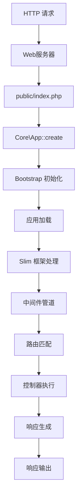
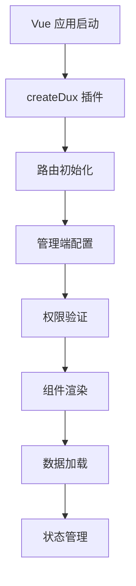

# 请求生命周期

理解请求生命周期是深入掌握 Dux PHP Admin 和 Dux Vue 框架的关键。本指南将详细介绍从用户发起请求到返回响应的完整流程，包括后端 PHP 应用和前端 Vue 应用的生命周期。

## 生命周期概述

### 后端生命周期



### 前端生命周期



## 1. 后端请求处理

### 1.1 应用入口

所有 HTTP 请求都通过 `public/index.php` 进入应用：

```php
<?php
// public/index.php - 应用入口点

require __DIR__ . '/../vendor/autoload.php';
use Core\App;

// 1. 创建应用实例
App::create(basePath: dirname(__DIR__));

// 2. 启动 Web 服务
App::runWeb();
```

**核心原理：**
- 单一入口点设计，所有请求统一处理
- 自动加载 Composer 依赖
- 根据环境选择运行模式（Web/Worker）

### 1.2 应用初始化

应用初始化分为两个阶段：

```php
// 第一阶段：基础初始化
App::create() {
    // 设置应用路径
    // 加载环境变量
    // 创建依赖注入容器
    // 初始化 Bootstrap
}

// 第二阶段：服务注册
Bootstrap::init() {
    registerFunc()      // 注册公共函数
    registerConfig()    // 加载配置文件
    registerWeb()       // 初始化 Slim 框架
    registerPlugin()    // 注册插件系统
}
```

**核心原理：**
- **路径设置**：确定应用的各个目录路径
- **环境配置**：加载 `.env` 文件中的环境变量
- **依赖注入**：创建全局的 DI 容器
- **服务注册**：注册框架核心服务

### 1.3 Web 服务初始化

Bootstrap 负责初始化 Web 服务：

```php
// Web 服务初始化流程
registerWeb() {
    // 1. 创建 Slim 应用实例
    $this->web = AppFactory::create();

    // 2. 配置路由缓存（生产环境）
    if (!$debug) {
        $routeCollector->setCacheFile("cache/route.cache");
    }
}
```

**核心原理：**
- **Slim 框架**：使用 Slim 作为 HTTP 处理核心
- **依赖注入**：将 DI 容器绑定到 Slim 应用
- **路由缓存**：生产环境缓存路由提升性能

### 1.4 应用加载

应用加载是一个多阶段的过程：

```php
// 应用加载的核心流程
loadApp() {
    // 阶段1：模块注册
    foreach ($modules as $module) {
        $module->init()      // 配置资源和路由
    }

    // 阶段2：服务注册
    foreach ($modules as $module) {
        $module->register()  // 注册服务到容器
    }

    // 阶段3：注解扫描
    registerAttribute()      // 扫描注解并自动注册

    // 阶段4：路由注册
    foreach ($routes as $route) {
        $route->run($web)    // 注册到 Slim 框架
    }

    // 阶段5：模块启动
    foreach ($modules as $module) {
        $module->boot()      // 执行启动逻辑
    }
}
```

**核心原理：**
- **模块化架构**：每个功能模块独立管理
- **生命周期钩子**：init → register → boot 三阶段
- **注解驱动**：自动扫描和注册路由、事件等
- **插件系统**：支持第三方扩展

### 1.5 模块生命周期

每个模块都有标准的三阶段生命周期：

```php
// 模块生命周期示例
class SystemApp extends AppExtend
{
    // 阶段1：初始化配置
    public function init(Bootstrap $app): void
    {
        // 配置资源路径和中间件
        App::resource()->set("admin", new Resource('/admin'));

        // 配置路由分组
        App::route()->set("api", new Route("/api"));
    }

    // 阶段2：服务注册
    public function register(Bootstrap $app): void
    {
        // 注册服务到 DI 容器
        $app->set(UserService::class, new UserService());
    }

    // 阶段3：启动完成
    public function boot(Bootstrap $app): void
    {
        // 执行启动后的逻辑
        // 注册事件监听器等
    }
}
```

**核心原理：**
- **init()**：配置阶段，设置路由和资源
- **register()**：注册阶段，绑定服务到容器
- **boot()**：启动阶段，执行初始化完成后的逻辑

### 1.6 请求处理

应用启动完成后开始处理 HTTP 请求：

```php
// 请求处理流程
App::runWeb() {
    loadApp()      // 加载所有模块
    loadRoute()    // 加载路由配置
    runWeb()       // 启动 Slim 框架
}

// Web 服务启动
runWeb() {
    // 1. 添加全局中间件
    $web->add(new CorsMiddleware());
    $web->add(new LangMiddleware());

    // 2. 配置错误处理
    $web->addErrorMiddleware();

    // 3. 启动 HTTP 服务
    $web->run();
}
```

**核心原理：**
- **中间件栈**：请求经过多层中间件处理
- **错误处理**：统一的异常处理机制
- **Slim 框架**：基于 PSR-7/PSR-15 标准

## 2. 中间件系统

### 2.1 中间件原理

中间件采用洋葱模型，请求和响应都会经过中间件处理：

```php
// 中间件基本结构
class ExampleMiddleware implements MiddlewareInterface
{
    public function process(Request $request, RequestHandler $handler): Response
    {
        // 请求前处理
        $request = $this->beforeRequest($request);

        // 传递给下一个中间件
        $response = $handler->handle($request);

        // 响应后处理
        $response = $this->afterResponse($response);

        return $response;
    }
}
```

### 2.2 常用中间件

```php
// 语言中间件 - 处理国际化
class LangMiddleware {
    // 从请求头解析语言设置
    // 设置到全局容器
}

// 认证中间件 - 验证用户身份
class AuthMiddleware {
    // 检查登录状态
    // 验证权限
}

// 操作日志中间件 - 记录用户操作
class OperateMiddleware {
    // 记录非 GET 请求
    // 统计执行时间
}

// 访问统计中间件 - 统计访问量
class VisitorMiddleware {
    // 检查安装状态
    // 统计页面访问
}
```

**核心原理：**
- **洋葱模型**：请求层层进入，响应层层返回
- **PSR-15 标准**：统一的中间件接口
- **链式调用**：中间件按顺序执行

## 3. 路由系统

### 3.1 路由注册

DuxLite 提供灵活的路由注册方式：

```php
// 基本路由注册
class Route
{
    // HTTP 方法路由
    public function get($pattern, $handler, $name) { }
    public function post($pattern, $handler, $name) { }
    public function put($pattern, $handler, $name) { }
    public function delete($pattern, $handler, $name) { }

    // 路由分组
    public function group($pattern, ...$middleware) {
        return new Route($pattern, $middleware);
    }
}
```

### 3.2 路由配置

```php
// 模块中配置路由
class SystemApp extends AppExtend
{
    public function init(Bootstrap $app): void
    {
        // Web 路由组
        App::route()->set("web", new Route(""));

        // API 路由组（带认证中间件）
        App::route()->set("api", new Route("/api", new ApiMiddleware()));

        // 管理后台路由组
        App::resource()->set("admin", new Resource('/admin'));
    }
}
```

### 3.3 注解路由

支持通过注解自动注册路由：

```php
// 控制器中使用注解
class UserController
{
    #[Route(methods: 'GET', route: '/users')]
    public function index() {
        // 用户列表
    }

    #[Route(methods: 'POST', route: '/users')]
    public function store() {
        // 创建用户
    }
}
```

**核心原理：**
- **分组管理**：按功能模块组织路由
- **中间件绑定**：路由级别的中间件支持
- **注解驱动**：自动扫描和注册
- **优先级控制**：路由匹配顺序管理

### 3.3 注解路由

支持通过注解自动注册路由：

```php
// 控制器中使用注解
class UserController
{
    #[Route(methods: 'GET', route: '/users')]
    public function index() {
        // 用户列表
    }

    #[Route(methods: 'POST', route: '/users')]
    public function store() {
        // 创建用户
    }
}
```

### 3.4 控制器处理

路由匹配后会调用对应的控制器方法：

```php
// 控制器处理流程
class Controller
{
    public function handle(Request $request): Response
    {
        // 1. 参数验证
        $params = $this->validate($request);

        // 2. 业务处理
        $result = $this->service->process($params);

        // 3. 响应返回
        return $this->response($result);
    }
}
```

## 4. 前端 Vue 应用生命周期

### 4.1 应用创建

前端使用 Vue 3 + Dux Vue 框架：

```typescript
// 应用入口
import { createApp } from 'vue'
import { createDux } from '@duxweb/dvha-core'

const app = createApp(DuxApp)

// 配置 Dux 插件
const dux = createDux({
  title: 'Dux Admin',
  manages: [/* 管理端配置 */]
})

app.use(dux)
app.mount('#app')
```

### 4.2 插件初始化

```typescript
// Dux 插件安装过程
createDux(config) {
  return {
    install(app) {
      // 1. 状态管理
      app.use(createPinia())

      // 2. 路由系统
      app.use(initRouter(config))

      // 3. 全局配置
      app.provide('dux.config', config)

      // 4. 权限指令
      app.directive('can', permissionDirective)
    }
  }
}
```

**核心原理：**
- **Vue 插件系统**：通过插件扩展 Vue 应用
- **依赖注入**：全局配置通过 provide/inject 传递
- **状态管理**：使用 Pinia 管理应用状态

### 4.3 路由初始化

前端路由支持多管理端架构：

```typescript
// 路由初始化
initRouter(config) {
  const routes = []

  // 为每个管理端创建路由
  config.manages.forEach(manage => {
    routes.push({
      name: manage.name,
      path: `/${manage.name}`,
      children: [
        // 需要认证的路由
        { name: `${manage.name}.auth`, children: authRoutes },
        // 无需认证的路由
        { name: `${manage.name}.noAuth`, children: noAuthRoutes }
      ]
    })
  })

  return createRouter({ routes })
}
```

**核心原理：**
- **多管理端**：支持多个独立的管理系统
- **权限路由**：区分需要认证和无需认证的路由
- **动态路由**：支持运行时动态添加路由

### 4.4 路由守卫

前端路由守卫负责权限验证和路由管理：

```typescript
// 路由守卫核心逻辑
router.beforeEach(async (to, from, next) => {
  const manageName = to.meta.manageName

  // 1. 管理端检查
  if (!manageName) {
    return next(`/${defaultManage}`)
  }

  // 2. 权限验证
  if (needAuth && !isLogin()) {
    return next('/login')
  }

  // 3. 动态路由加载
  if (!routeLoaded) {
    await loadRoutes()
    return next(to.path)
  }

  // 4. 权限检查
  if (!hasPermission(to.name)) {
    return next('/403')
  }

  next()
})
```

**核心原理：**
- **权限验证**：检查用户登录状态和权限
- **动态路由**：根据权限动态加载路由
- **状态管理**：管理认证和路由状态

### 4.5 状态管理

使用 Pinia 管理应用状态，每个管理端独立：

```typescript
// 认证状态管理
const useAuthStore = (manageName) => {
  return defineStore(`auth.${manageName}`, () => {
    const user = ref(null)
    const token = ref('')

    const isLogin = () => !!token.value && !!user.value
    const login = (userData, tokenData) => {
      user.value = userData
      token.value = tokenData
    }
    const logout = () => {
      user.value = null
      token.value = ''
    }

    return { user, token, isLogin, login, logout }
  }, { persist: true })()
}

// 路由状态管理
const useRouteStore = (manageName) => {
  return defineStore(`route.${manageName}`, () => {
    const routes = ref([])
    const init = ref(false)

    const setRoutes = (routeData) => {
      routes.value = routeData
      init.value = true
    }

    return { routes, init, setRoutes }
  })()
}
```

**核心原理：**
- **状态隔离**：每个管理端独立的状态空间
- **持久化**：认证状态自动持久化到本地存储
- **响应式**：状态变化自动更新 UI

## 5. 数据流和通信

### 5.1 前后端通信

前端通过 HTTP API 与后端通信：

```typescript
// API 请求配置
const api = {
  baseURL: '/admin',
  headers: { Authorization: `Bearer ${token}` }
}

// 请求示例
const getUserList = async (params) => {
  const response = await fetch('/admin/users', {
    method: 'GET',
    headers: api.headers,
    body: JSON.stringify(params)
  })
  return response.json()
}
```

### 5.2 事件系统

后端支持事件驱动架构：

```php
// 触发事件
App::event()->dispatch('user.created', $user);

// 监听事件
#[Listener(event: 'user.created')]
class UserCreatedListener
{
    public function handle($user): void
    {
        // 发送邮件、记录日志等
    }
}
```

**核心原理：**
- **RESTful API**：标准的 HTTP API 接口
- **事件解耦**：通过事件实现模块间松耦合
- **异步处理**：支持队列和异步任务

## 6. 性能优化

### 6.1 后端优化

```php
// 路由缓存
if (!$debug) {
    $routeCollector->setCacheFile("cache/route.cache");
}

// PHP 配置优化
opcache.enable=1
opcache.memory_consumption=256
```

### 6.2 前端优化

```typescript
// 路由懒加载
const routes = [
  {
    path: '/users',
    component: () => import('./pages/Users.vue')
  }
]

// 组件缓存
<KeepAlive>
  <Component />
</KeepAlive>
```

**优化要点：**
- **缓存机制**：路由缓存、OPcache、组件缓存
- **懒加载**：按需加载路由和组件
- **代码分割**：减少初始加载体积

## 7. 总结

### 7.1 生命周期概览

**后端生命周期：**
1. **入口** - `public/index.php` → `App::create()`
2. **初始化** - 环境变量 → DI 容器 → Bootstrap
3. **加载** - 模块注册 → 路由配置 → 注解扫描
4. **处理** - 中间件 → 路由匹配 → 控制器执行

**前端生命周期：**
1. **创建** - Vue 应用 → Dux 插件
2. **配置** - 路由系统 → 状态管理
3. **守卫** - 权限验证 → 动态路由
4. **渲染** - 组件加载 → 数据绑定

### 7.2 核心特性

- **模块化**：独立的模块生命周期管理
- **中间件**：洋葱模型的请求处理
- **注解驱动**：自动化的配置和注册
- **前后分离**：独立的前后端架构
- **状态管理**：响应式的状态系统

### 7.3 开发要点

1. **掌握生命周期**：理解应用启动和请求处理流程
2. **合理分层**：在正确的生命周期阶段执行相应逻辑
3. **模块设计**：按功能划分，保持低耦合高内聚
4. **性能优化**：利用缓存和懒加载提升性能
5. **调试技巧**：根据生命周期定位问题

理解生命周期有助于：
- 快速定位和解决问题
- 设计合理的应用架构
- 优化应用性能
- 提高开发效率